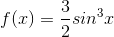

Description
===========

An integral
~~~~~~~~~~~

..image:: integral.gif

can be approximated by the so-called Simpson’s rule:

..image:: simpson.gif

Here :math:`h = (b-a)/n`, n being an even integer and :math:`a <= b`. We want to try Simpson's rule with the function f:

The task is to write a function called simpson with parameter n which returns the value of the integral of f on the interval  :math:`[0,\pi]`. The tests will pass if :math:`abs(your_result - test_result) <= 1e-10)`. n will always be even.

Note: we know that the exact value of the integral of f on the given interval is 2.
